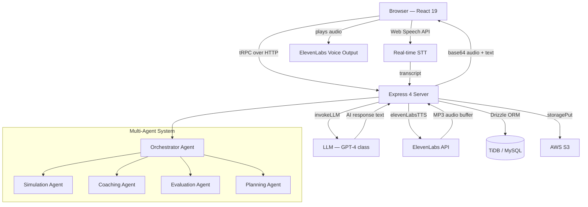

# Agent Forge — AI-Powered Practice Simulation Platform

[](https://www.agentforge.org.uk)
[](https://www.agentforge.org.uk)
[](https://www.agentforge.org.uk)
[](https://www.agentforge.org.uk)
[](https://www.agentforge.org.uk)
[](https://www.agentforge.org.uk)
[](https://www.agentforge.org.uk)
[](https://www.agentforge.org.uk)

---

> **Agent Forge replaces static training scripts with dynamic, adaptive AI scenarios that respond to the learner in real time** — for enterprise support teams, graduate scheme candidates, sales professionals, and anyone who wants to practise high-stakes conversations before they happen for real.

**Live platform:** [www.agentforge.org.uk](https://www.agentforge.org.uk) — no login required  
**Architecture deep-dive:** [www.agentforge.org.uk/architecture](https://www.agentforge.org.uk/architecture)  
**Author:** [samirdas.co.uk](https://samirdas.co.uk)

---

## Table of Contents

1. [The Problem It Solves](#the-problem-it-solves)
2. [Key Capabilities](#key-capabilities)
3. [System Architecture](#system-architecture)
4. [Learning Science Foundations](#learning-science-foundations)
5. [50-Point Competency Rubric](#50-point-competency-rubric)
6. [AI Coaching Module](#ai-coaching-module)
7. [Coaching Agent — 3-Tier Intervention System](#coaching-agent--3-tier-intervention-system)
8. [Inter-Agent Communication](#inter-agent-communication--cascade-example)
9. [Voice Simulation Pipeline](#voice-simulation-pipeline)
10. [Tech Stack](#tech-stack)
11. [Competitive Differentiation](#competitive-differentiation)
12. [Key Engineering Decisions](#key-engineering-decisions)
13. [Database Schema](#database-schema-19-tables)
14. [Project Structure](#project-structure)
15. [Running Locally](#running-locally)
16. [Testing](#testing)
17. [About the Author](#about-the-author)
18. [Partner Organisations](#partner-organisations)
19. [Licence](#licence)

---

## The Problem It Solves

Traditional training simulations are scripted. They follow a fixed decision tree regardless of what the learner says. A customer who escalates unexpectedly, an interviewer who asks a follow-up, a negotiation that pivots — none of these are handled by a script. Learners memorise paths rather than developing genuine conversational competence.

Agent Forge uses a **multi-agent AI system** to generate scenarios that adapt in real time — escalating difficulty, shifting persona emotional state, and adjusting coaching feedback based on how the session is actually going. The platform covers five core training domains: customer service, sales, job interviews, negotiation, and presentation skills.

---

## Key Capabilities

| Capability | Detail |
|---|---|
| **Seamless voice simulation** | Speak naturally — mic listens, silence detected after 1.5s, transcript sent to AI, ElevenLabs voice responds. Zero buttons between speaking and hearing the reply. |
| **ElevenLabs persona voices** | Each AI persona has a matched ElevenLabs voice ID. Language switching is automatic — 32 languages via `eleven_multilingual_v2`. |
| **Multi-agent AI orchestration** | Five autonomous agents (Simulation, Coaching, Evaluation, Planning, Orchestrator) operate independently and pass context between each other. |
| **Adaptive difficulty engine** | Scenario complexity adjusts in real time — modifying persona emotional state, objection intensity, and technical complexity based on learner performance. |
| **50-point competency rubric** | Every session scored across 6 domains (Decision Quality, Process Adherence, Communication, Tool Proficiency, Documentation, Time Efficiency) by the Evaluation Agent. |
| **Session analytics** | Scores feed a Predictive Readiness Score (PRS) model that estimates time-to-production-threshold across 5 weighted signals. |
| **Video interview practice** | Tavus CVI real-time video interview with AI avatar, structured feedback report, LinkedIn share. |
| **eLearning course builder** | AI generates structured courses from uploaded documents — lessons, quizzes, flashcards. |
| **Career prep module** `Beta` | Industry-specific question banks, live AI interviewer, post-session feedback report. |
| **AI Coaching module** `Beta` | 4 coach personas grounded in GROW, Clean Language, SFBC, and Gestalt frameworks. Voice-enabled 1:1 sessions with post-session insight reports. |
| **Agentic dashboard** | Real-time view of the AI agent system — active agents, inter-agent messages, task queue, orchestration events. |
| **Feature experimentation sandbox** | LaunchDarkly-style feature flags with statistical confidence measurement, built into the platform. |
| **17-language support** | Full UI and simulation localisation across 17 languages. |

---

## System Architecture



---

## Learning Science Foundations

Agent Forge's architecture is grounded in three evidence-based learning science frameworks. Each framework directly informs a distinct technical component — the connection between pedagogy and engineering is explicit, not incidental.

### 01 — Ericsson's Deliberate Practice Theory
**Informs:** Unlimited Repetition with Immediate Feedback

Expert-level performance is not the result of innate talent but of sustained, focused practice with immediate feedback. Agent Forge implements this through unlimited repetition of targeted scenarios with real-time coaching interventions — the digital equivalent of Rapid Cycle Deliberate Practice (RCDP) used in medical simulation training.

### 02 — Vygotsky's Zone of Proximal Development
**Informs:** Adaptive Difficulty Calibration

Learning occurs most effectively in the zone between what a learner can accomplish independently and what they can achieve with guidance. The Adaptive Difficulty Agent functions as a digital scaffold, continuously calibrating challenge levels to maintain each learner within their personal ZPD — never so easy that learning stalls, never so difficult that confidence collapses.

### 03 — Bloom's Revised Taxonomy
**Informs:** Higher-Order Assessment Design

Rather than testing recall (Level 1) or comprehension (Level 2), Agent Forge evaluates at the higher-order levels: Application, Analysis, and Evaluation. This ensures training transfers to production performance rather than merely testing memorisation of procedures. Most platforms assess at Bloom's Level 1–2 via multiple-choice quizzes; Agent Forge assesses at Levels 3–6 through authentic performance.

---

## 50-Point Competency Rubric

Every simulation session is automatically scored across 6 competency domains by the Evaluation Agent. The rubric satisfies three requirements simultaneously: pedagogical validity, production alignment, and predictive power.

> Scoring uses a **criterion-referenced approach** — scores reflect absolute competency against defined standards, not relative performance against peers. The rubric deliberately targets Bloom's Levels 3–6 (Apply, Analyse, Evaluate, Create).

| Domain | Points | Weight | Bloom's Level | Example Assessment |
|---|---|---|---|---|
| Decision Quality | 15 | 30% | Analyse / Evaluate (L4–L5) | Did the agent identify root cause from multiple symptoms? |
| Process Adherence | 10 | 20% | Apply (L3) | Did the agent apply the correct verification procedure? |
| Communication | 10 | 20% | Evaluate / Create (L5–L6) | Did the agent synthesise a coherent case summary? |
| Tool Proficiency | 5 | 10% | Apply (L3) | Did the agent use the CRM tools correctly and efficiently? |
| Documentation | 5 | 10% | Create (L6) | Did the agent produce accurate, complete case notes? |
| Time Efficiency | 5 | 10% | Apply (L3) | Did the agent resolve the issue within the target handle time? |

### Kirkpatrick 4-Level Alignment

| Level | Kirkpatrick | Agent Forge Implementation |
|---|---|---|
| 1 | Reaction | Post-session satisfaction score |
| 2 | Learning | 50-point rubric domain breakdown |
| 3 | Behaviour | Score trajectory and coaching dependency reduction over time |
| 4 | Results | Predictive Readiness Score estimating time-to-production-threshold |

---

## AI Coaching Module

> `Beta` — Voice-enabled 1:1 coaching with 4 AI personas, each grounded in a distinct evidence-based coaching framework.

The AI Coaching module is a separate experience from simulation — rather than practising against a customer or interviewer, the user has a reflective 1:1 coaching conversation. The coach never tells the user what to do; it asks the question that unlocks the next level of thinking.

### Coach Personas

| Coach | Style | Framework | Focus |
|---|---|---|---|
| **Maya Chen** | Socratic / Reflective | Clean Language + Appreciative Inquiry | Leadership identity, self-awareness, values |
| **James Whitfield** | GROW Model | Goal → Reality → Options → Will | Sales performance, career targets, goal-setting |
| **Priya Sharma** | Solution-Focused | SFBC + Narrative Coaching | Career transitions, confidence, imposter syndrome |
| **Marcus Reid** | Directive / Challenge | Gestalt + Ontological Coaching | Executive presence, stakeholder influence |

### Session Arc

```
Check-in  →  Exploration  →  Insight  →  Action  →  Close
```

### Post-Session Report Fields

| Field | Description |
|---|---|
| Key Insight | The single most important realisation from the session |
| Breakthrough Moment | The exact exchange where the shift happened |
| Commitment Made | The specific action the coachee committed to |
| Strengths Observed | Qualities the coach noticed during the session |
| Growth Edge | The one area to focus on before the next session |
| Reflection Questions | 3 questions to sit with before the next session |
| Coach's Note | A personal closing note from the coach persona |

---

## Coaching Agent — 3-Tier Intervention System

The Coaching Agent monitors learner actions in real time and delivers contextual interventions calibrated to avoid disrupting simulation flow. Research shows that forced scaffolding creates dependency — so interventions are severity-tiered and non-intrusive by design.

| Tier | Trigger | UX Pattern |
|---|---|---|
| **Hint** | Missed opportunity | Non-blocking notification badge |
| **Warning** | Procedural error | Slide-in panel, requires acknowledgement |
| **Critical** | Compliance violation | Full overlay, requires correction before continuing |

---

## Inter-Agent Communication — Cascade Example

The orchestration layer manages a shared state bus where agents publish events and subscribe to relevant signals. A single learner action can trigger a coordinated cascade across all five agents:

| Step | Agent | Action |
|---|---|---|
| 1 | Learner | Submits response via tRPC `speakText` procedure |
| 2 | Simulation Agent | Generates customer reply within persona constraints |
| 3 | Coaching Agent | Evaluates response against compliance rules and best-practice benchmarks |
| 4 | Coaching Agent | Publishes `CRITICAL_ERROR` event to shared state bus |
| 5 | Adaptive Difficulty Agent | Subscribes to `CRITICAL_ERROR` — reduces persona complexity by 0.2 to prevent confidence collapse |
| 6 | Evaluation Agent | Logs error with timestamp for post-session rubric scoring |
| 7 | Planning Agent | Receives session-end summary and adjusts the learner's personalised learning path |

---

## Voice Simulation Pipeline

The voice loop is the core UX innovation. The original flow had four manual steps and 6–8 seconds of perceived latency. The redesigned flow has **zero manual steps**.

| Phase | Duration | What Happens |
|---|---|---|
| **1 — Capture** | 0ms | Web Speech API starts listening. Interim results stream into the live transcript bubble in real time. |
| **2 — Silence Detection** | 0–1500ms | A 1.5s silence timer fires when the user stops speaking. Transcript submitted automatically — no button press. |
| **3 — AI Generation** | 500–2000ms | `invokeLLM()` called with persona system prompt + conversation history + user message. Scoring agent evaluates in parallel. |
| **4 — TTS Synthesis** | 200–600ms | `elevenLabsTTS()` called with persona-matched voice ID. `eleven_turbo_v2_5` returns MP3 in ~350–400ms. |
| **5 — Playback + Auto-restart** | 0ms perceived | Audio plays. On `onended`, Web Speech API restarts automatically. Loop is continuous. |

**Total round-trip latency:** ~3.4s from last word spoken to first word of AI response — comparable to a natural conversational pause.

---

## Tech Stack

| Layer | Technology | Reason for Choice |
|---|---|---|
| Frontend | React 19 + TypeScript | Concurrent rendering, strong typing |
| Styling | Tailwind CSS 4 + shadcn/ui | OKLCH design tokens, accessible components |
| API layer | tRPC 11 + Superjson | End-to-end type safety, no code generation |
| Backend | Express 4 + Node.js | Lightweight, serverless-compatible |
| ORM | Drizzle ORM | Pure TypeScript, no native binary, TiDB-compatible |
| Database | MySQL / TiDB | Relational integrity, horizontal scalability |
| Voice synthesis | ElevenLabs `eleven_turbo_v2_5` | <400ms latency, 32-language auto-switching |
| Speech recognition | Web Speech API + Whisper fallback | Zero-latency STT; Whisper for Safari/Firefox |
| File storage | AWS S3 | Presigned URL access, no local file storage |
| Hosting | Cloud Run Autoscale | Cost-zero when idle, scales on demand |

---

## Competitive Differentiation

Agent Forge occupies a unique position — combining multi-agent AI simulation with adaptive difficulty, a 50-point automated rubric, and zero licence cost. No existing commercial platform implements all of these capabilities in a single product.

| Platform | Approach | Limitation vs Agent Forge |
|---|---|---|
| Second Nature | AI role-play for sales | Single-agent, sales-only, no CRM simulation or multi-agent orchestration |
| Solidroad | AI conversation practice | No multi-agent orchestration, no adaptive difficulty, no 50-point rubric |
| Mindtickle | Revenue enablement | Sales-focused, no customer service depth, no real-time coaching tiers |
| Whatfix / WalkMe | Digital adoption platforms | Guidance overlays only — not simulation-based training |
| Articulate Rise | eLearning authoring | Static content, no AI, no real-time interaction or adaptive difficulty |

---

## Key Engineering Decisions

### Why Web Speech API over Whisper for the primary STT path

The initial implementation uploaded audio to Whisper after the user tapped a Stop button. End-to-end latency was 4–8 seconds per turn, and the three-step interaction (tap Record → speak → tap Stop → tap Send) broke simulation immersion. The Web Speech API provides continuous real-time transcription with zero upload latency. The silence detector replaces the Stop button entirely. Whisper remains as a fallback for Safari and Firefox, which have incomplete Web Speech API support.

### Why `eleven_turbo_v2_5` over `eleven_multilingual_v2`

The standard multilingual model produces higher-quality, more expressive audio but has ~1.2s latency. In a conversational simulation, that extra 800ms is perceptible and breaks the rhythm. The turbo model returns audio in ~350–400ms. The expressiveness trade-off is acceptable because the simulation context (professional roleplay) does not require dramatic vocal range — clarity and naturalness matter more than expressiveness.

### Why Drizzle ORM over Prisma

Prisma's query engine is a native Rust binary that requires a specific build image to run on Cloud Run. Drizzle ORM is a pure TypeScript/JavaScript library — it compiles to raw SQL, has no native binary dependency, and is fully compatible with TiDB's MySQL wire protocol. Drizzle rows are returned directly from tRPC procedures without a DTO mapping layer, reducing boilerplate by approximately 25%.

### Why tRPC over REST

Type safety flows from the database schema through to the React component without any intermediate contract files or code generation steps. Refactoring a procedure signature immediately surfaces every call site that needs updating at compile time. The alternative — REST + OpenAPI + generated client — would add a code generation step to every schema change and introduce a class of runtime type-mismatch bugs that tRPC eliminates entirely.

### The silence detection tuning problem

The first version used a fixed 1.0-second silence threshold. In practice, users naturally pause mid-sentence — especially when thinking through a complex objection or formulating a negotiation position. A 1.0s threshold triggered the submission on these mid-sentence pauses, cutting the user off and sending an incomplete message to the AI. Testing at 1.5s eliminated false triggers while keeping the response feel immediate. A future improvement would use voice activity detection (VAD) rather than a fixed timer.

---

## Database Schema (19 tables)

| Table | Purpose |
|---|---|
| `users` | Auth identity, role, streak tracking, aggregate stats |
| `scenarios` | Simulation blueprints — persona, system prompt, channel, language |
| `sessions` | Practice session lifecycle — status, per-dimension scores, feedback |
| `messages` | Conversation turns with per-message scores and AI feedback |
| `walkthroughs` | Step-by-step guided practice module definitions |
| `walkthrough_completions` | Per-user walkthrough progress tracking |
| `courses` | AI-generated eLearning courses from uploaded documents |
| `lessons` | Ordered lesson units within a course |
| `content_blocks` | Atomic content units — text, key-concept, quiz, summary |
| `course_enrollments` | Learner progress and completion state per course |
| `sandbox_instances` | Product sandbox environments with status and preview URLs |
| `feature_flags` | Rollout percentage, targeting rules, kill switches |
| `test_runs` | Synthetic conversation test scripts and pass/fail results |
| `personas` | Reusable AI persona definitions with version history |
| `sandbox_events` | Full event stream per sandbox for replay and audit |
| `agent_events` | Agentic system events — nudges, interventions, orchestration logs |
| `coaching_nudges` | AI-generated coaching interventions per learner |
| `learning_paths` | Adaptive learning path recommendations per user |
| `difficulty_adjustments` | Dynamic difficulty tuning records per session |

---

## Project Structure

```
client/
  src/
    pages/          ← SimulationSession, CareerPrep, Coaching, AgenticDashboard, Architecture
    components/     ← AIChatBox, DashboardLayout, Map, voice orb animations
    hooks/          ← useAuth, custom tRPC hooks
    lib/trpc.ts     ← tRPC client binding
drizzle/
  schema.ts         ← 19 database tables, all types
server/
  routers.ts        ← tRPC procedures (simulation, coaching, evaluation, auth)
  routers/
    coaching.ts       ← AI Coaching — listCoaches, chat, speak, generateReport
    interview.ts      ← Career Prep — question banks, AI interviewer, feedback
  db.ts             ← Drizzle query helpers
  _core/
    elevenLabsTTS.ts  ← Persona-to-voice-ID mapping, turbo model, fallback logic
    llm.ts            ← LLM invocation helper (structured + streaming)
    voiceTranscription.ts ← Whisper fallback STT
    notification.ts   ← Owner notification helper
storage/
  index.ts          ← S3 storagePut / storageGet helpers
shared/             ← Constants and types shared across client/server
```

---

## Running Locally

```bash
# Clone the repository
git clone https://github.com/samirdas4u/agent-forge.git
cd agent-forge

# Install dependencies
pnpm install

# Set environment variables
cp .env.example .env
# Required: DATABASE_URL, JWT_SECRET, ELEVENLABS_API_KEY, VITE_APP_ID

# Apply database migrations
pnpm drizzle-kit generate
# Apply the generated SQL via your database client

# Start development server
pnpm dev
```

The development server starts on `http://localhost:3000`. Frontend and backend share the same port via Vite's proxy configuration.

---

## Testing

```bash
pnpm test
```

12 tests across authentication flows, simulation procedures, and ElevenLabs TTS integration. All tests run in under 5 seconds using Vitest.

---

## About the Author

Built by **Samir Das** — AI Learning & Knowledge Technology Architect with experience designing and deploying AI-powered training systems at scale within large technology organisations.

| | |
|---|---|
| Personal site | [samirdas.co.uk](https://samirdas.co.uk) |
| Platform | [agentforge.org.uk](https://www.agentforge.org.uk) |
| Architecture deep-dive | [agentforge.org.uk/architecture](https://www.agentforge.org.uk/architecture) |
| GitHub | [github.com/samirdas4u](https://github.com/samirdas4u) |

---

## Partner Organisations

| Organisation | Focus | Link |
|---|---|---|
| **Learning Catalyst** | AI-powered eLearning platform and instructional design | [learningcatalyst.co.uk](https://www.learningcatalyst.co.uk) |
| **Sam's Digital Consultancy** | AI-powered learning strategy, digital transformation, and capability development | [samsdigitalconsultancy.co.uk](https://www.samsdigitalconsultancy.co.uk) |

---

## Licence

MIT — free to use, fork, and build on.
