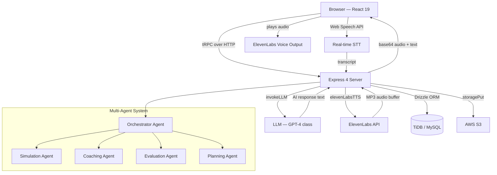

# Agent Forge — AI-Powered Practice Simulation Platform


> Agent Forge replaces static training scripts with dynamic, adaptive AI scenarios that respond to the learner in real time — for enterprise support teams, graduate scheme candidates, sales professionals, and anyone who wants to practise high-stakes conversations before they happen for real.

**Live platform:** [www.agentforge.org.uk](https://www.agentforge.org.uk) — no login required  
**Architecture deep-dive:** [www.agentforge.org.uk/architecture](https://www.agentforge.org.uk/architecture)

---

## The Problem It Solves

Traditional training simulations are scripted. They follow a fixed decision tree regardless of what the learner says. A customer who escalates unexpectedly, an interviewer who asks a follow-up, a negotiation that pivots — none of these are handled by a script. Learners memorise paths rather than developing genuine conversational competence.

Agent Forge uses a multi-agent AI system to generate scenarios that adapt in real time — escalating difficulty, shifting persona emotional state, and adjusting coaching feedback based on how the session is actually going. The platform covers five core training domains: customer service, sales, job interviews, negotiation, and presentation skills.

---

## Key Capabilities

| Capability | Detail |
|---|---|
| **Seamless voice simulation** | Speak naturally — mic listens, silence is detected after 1.5s, transcript sent to AI, ElevenLabs voice responds. Zero buttons between speaking and hearing the reply. |
| **ElevenLabs persona voices** | Each AI persona has a matched ElevenLabs voice ID. Language switching is automatic — 32 languages handled by `eleven_multilingual_v2`. |
| **Multi-agent AI orchestration** | Five autonomous agents (Simulation, Coaching, Evaluation, Planning, Orchestrator) operate independently and pass context between each other. |
| **Adaptive difficulty engine** | Scenario complexity adjusts in real time — modifying persona emotional state, objection intensity, and technical complexity based on learner performance. |
| **Session analytics** | Every session scored across communication clarity, empathy, problem-solving, and professionalism. Scores feed a readiness prediction model. |
| **Video interview practice** | Tavus CVI real-time video interview with AI avatar, structured feedback report, LinkedIn share. |
| **eLearning course builder** | AI generates structured courses from uploaded documents — lessons, quizzes, flashcards. |
| **Career prep module** `Beta` | Industry-specific question banks, live AI interviewer, post-session feedback report. Voice experience actively improving — feedback welcome. |
| **Agentic dashboard** | Real-time view of the AI agent system — active agents, inter-agent messages, task queue, orchestration events. |
| **Feature experimentation sandbox** | LaunchDarkly-style feature flags with statistical confidence measurement, built into the platform. |
| **17-language support** | Full UI and simulation localisation. |

---

## System Architecture


```mermaid
graph TD
    A[Browser — React 19] -->|tRPC over HTTP| B[Express 4 Server]
    A -->|Web Speech API| A2[Real-time STT]
    A2 -->|transcript| B
    B -->|invokeLLM| C[LLM — GPT-4 class]
    B -->|elevenLabsTTS| D[ElevenLabs API]
    B -->|Drizzle ORM| E[(TiDB / MySQL)]
    B -->|storagePut| F[AWS S3]
    C -->|AI response text| B
    D -->|MP3 audio buffer| B
    B -->|base64 audio + text| A
    A -->|plays audio| G[ElevenLabs Voice Output]

    subgraph Multi-Agent System
        H[Orchestrator Agent]
        I[Simulation Agent]
        J[Coaching Agent]
        K[Evaluation Agent]
        L[Planning Agent]
        H --> I
        H --> J
        H --> K
        H --> L
    end

    B --> H
```

---

## Voice Simulation Pipeline

The voice loop is the core UX innovation. The original flow had four manual steps and 6–8 seconds of perceived latency. The redesigned flow has zero manual steps.

### Phase 1 — Capture (0ms)
The browser's Web Speech API starts listening immediately when voice mode is entered. Interim results stream into a live transcript bubble in the UI — the user sees their words appearing as they speak, confirming the mic is active.

### Phase 2 — Silence Detection (0–1500ms)
A 1.5-second silence timer fires when the user stops speaking. This was tuned through testing — 1.0s triggered too early on natural pauses mid-sentence; 2.0s felt sluggish. The final transcript is submitted automatically via `trpc.simulation.speakText.useMutation` — no button press.

### Phase 3 — AI Generation (500–2000ms)
The server calls `invokeLLM()` with three inputs: the scenario system prompt (persona, emotional state, difficulty level), the full conversation history, and the user's latest message. The LLM returns a text response. Simultaneously, the session's scoring agent evaluates the user's message across five dimensions and appends a score object to the messages array.

### Phase 4 — TTS Synthesis (200–600ms)
The response text is passed to `elevenLabsTTS()` with the persona-matched voice ID. The `eleven_turbo_v2_5` model is used (not the standard model) — it returns audio in under 400ms at the cost of slightly lower expressiveness. The server returns an MP3 buffer as a base64 data URL.

### Phase 5 — Playback + Auto-restart (0ms perceived)
The client decodes the base64 URL into an `Audio` object and plays it. The animated orb transitions to 'speaking' state. When audio ends, the `onended` event fires — the orb returns to 'listening' state and the Web Speech API restarts automatically. The loop is continuous.

**Total round-trip latency:** ~1.5s silence detection + ~1.5s AI + ~0.4s TTS = ~3.4s from last word spoken to first word of AI response. Comparable to a natural conversational pause.

---

## Tech Stack

| Layer | Technology | Reason for choice |
|---|---|---|
| Frontend | React 19 + TypeScript | Concurrent rendering, strong typing |
| Styling | Tailwind CSS 4 + shadcn/ui | OKLCH design tokens, accessible components |
| API layer | tRPC 11 + Superjson | End-to-end type safety, no code generation |
| Backend | Express 4 + Node.js | Lightweight, serverless-compatible |
| ORM | Drizzle ORM | Pure TypeScript, no native binary, TiDB-compatible |
| Database | MySQL / TiDB | Relational integrity, horizontal scalability |
| Voice synthesis | ElevenLabs `eleven_turbo_v2_5` | <400ms latency, 32-language auto-switching |
| Speech recognition | Web Speech API + Whisper fallback | Zero-latency STT; Whisper for Safari/Firefox |
| File storage | AWS S3 | Presigned URL access, no local file storage |
| Hosting | Cloud Run Autoscale | Cost-zero when idle, scales on demand |

---

## Key Engineering Decisions

### Why Web Speech API over Whisper for the primary STT path

The initial implementation uploaded audio to Whisper after the user tapped a Stop button. End-to-end latency was 4–8 seconds per turn, and the three-step interaction (tap Record → speak → tap Stop → tap Send) broke simulation immersion. The Web Speech API provides continuous real-time transcription with zero upload latency. The silence detector replaces the Stop button entirely. Whisper remains as a fallback for Safari and Firefox, which have incomplete Web Speech API support.

### Why `eleven_turbo_v2_5` over `eleven_multilingual_v2`

The standard multilingual model produces higher-quality, more expressive audio but has ~1.2s latency. In a conversational simulation, that extra 800ms is perceptible and breaks the rhythm. The turbo model returns audio in ~350–400ms. The expressiveness trade-off is acceptable because the simulation context (professional roleplay) does not require dramatic vocal range — clarity and naturalness matter more than expressiveness.

### Why Drizzle ORM over Prisma

Prisma's query engine is a native Rust binary that requires a specific build image to run on Cloud Run. Drizzle ORM is a pure TypeScript/JavaScript library — it compiles to raw SQL, has no native binary dependency, and is fully compatible with TiDB's MySQL wire protocol. Drizzle rows are returned directly from tRPC procedures without a DTO mapping layer, reducing boilerplate by approximately 25%.

### Why tRPC over REST

Type safety flows from the database schema through to the React component without any intermediate contract files or code generation steps. Refactoring a procedure signature immediately surfaces every call site that needs updating at compile time. The alternative — REST + OpenAPI + generated client — would add a code generation step to every schema change and introduce a class of runtime type-mismatch bugs that tRPC eliminates entirely.

### The silence detection tuning problem

The first version used a fixed 1.0-second silence threshold. In practice, users naturally pause mid-sentence — especially when thinking through a complex objection or formulating a negotiation position. A 1.0s threshold triggered the submission on these mid-sentence pauses, cutting the user off and sending an incomplete message to the AI. Testing at 1.5s eliminated false triggers while keeping the response feel immediate. A future improvement would use voice activity detection (VAD) rather than a fixed timer.

---

## Database Schema (19 tables)

| Table | Purpose |
|---|---|
| `users` | Auth identity, role, streak tracking, aggregate stats |
| `scenarios` | Simulation blueprints — persona, system prompt, channel, language |
| `sessions` | Practice session lifecycle — status, per-dimension scores, feedback |
| `messages` | Conversation turns with per-message scores and AI feedback |
| `walkthroughs` | Step-by-step guided practice module definitions |
| `walkthrough_completions` | Per-user walkthrough progress tracking |
| `courses` | AI-generated eLearning courses from uploaded documents |
| `lessons` | Ordered lesson units within a course |
| `content_blocks` | Atomic content units — text, key-concept, quiz, summary |
| `course_enrollments` | Learner progress and completion state per course |
| `sandbox_instances` | Product sandbox environments with status and preview URLs |
| `feature_flags` | Rollout percentage, targeting rules, kill switches |
| `test_runs` | Synthetic conversation test scripts and pass/fail results |
| `personas` | Reusable AI persona definitions with version history |
| `sandbox_events` | Full event stream per sandbox for replay and audit |
| `agent_events` | Agentic system events — nudges, interventions, orchestration logs |
| `coaching_nudges` | AI-generated coaching interventions per learner |
| `learning_paths` | Adaptive learning path recommendations per user |
| `difficulty_adjustments` | Dynamic difficulty tuning records per session |

---

## Project Structure

```
client/
  src/
    pages/          ← SimulationSession, CareerPrep, AgenticDashboard, Architecture
    components/     ← AIChatBox, DashboardLayout, Map, voice orb animations
    hooks/          ← useAuth, custom tRPC hooks
    lib/trpc.ts     ← tRPC client binding
drizzle/
  schema.ts         ← 19 database tables, all types
server/
  routers.ts        ← tRPC procedures (simulation, coaching, evaluation, auth)
  db.ts             ← Drizzle query helpers
  _core/
    elevenLabsTTS.ts  ← Persona-to-voice-ID mapping, turbo model, fallback logic
    llm.ts            ← LLM invocation helper (structured + streaming)
    voiceTranscription.ts ← Whisper fallback STT
    notification.ts   ← Owner notification helper
storage/
  index.ts          ← S3 storagePut / storageGet helpers
shared/             ← Constants and types shared across client/server
```

---

## Running Locally

```bash
# Clone the repository
git clone https://github.com/samirdas4u/agent-forge.git
cd agent-forge

# Install dependencies
pnpm install

# Set environment variables
cp .env.example .env
# Required: DATABASE_URL, JWT_SECRET, ELEVENLABS_API_KEY, VITE_APP_ID

# Apply database migrations
pnpm drizzle-kit generate
# Apply the generated SQL via your database client

# Start development server
pnpm dev
```

The development server starts on `http://localhost:3000`. Frontend and backend share the same port via Vite's proxy configuration.

---

## Testing

```bash
pnpm test
```

12 tests across authentication flows, simulation procedures, and ElevenLabs TTS integration. All tests run in under 5 seconds using Vitest.

---

## About the Author

Built by **Samir Das** — AI Learning & Knowledge Technology Architect with experience designing and deploying AI-powered training systems at scale within large technology organisations.

- Platform: [agentforge.org.uk](https://www.agentforge.org.uk)
- Architecture: [agentforge.org.uk/architecture](https://www.agentforge.org.uk/architecture)
- GitHub: [github.com/samirdas4u](https://github.com/samirdas4u)

---

## Licence

MIT — free to use, fork, and build on.
